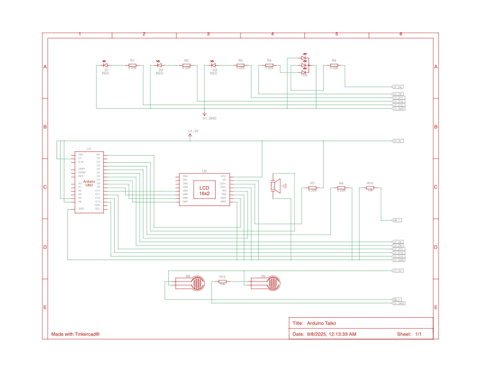

# arduino_taiko
A Taiko-inspired game implemented on an Arduino Uno-R3

> Note: Code is very unoptimized at the moment. There were a lot of hoops we had to jump through because the R3 didn't support multithreading, e.g., the loops of `delay(1)` waiting for user input.

## Demo

> full video is available at `resources/arduino_taiko_demo.mp4`

## Schematic
